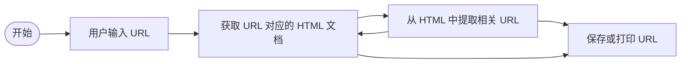
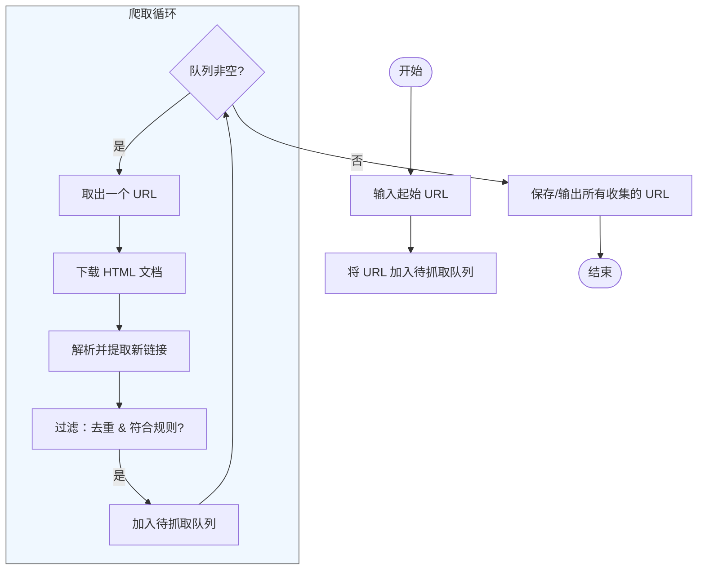

# draw.io 流程图与代码流程注释：实践与思考

## 一、核心观点

-   **draw.io 的适用场景** 对多数人而言，draw.io 更适合用于**项目稳定后**的可视化表达。但在快速迭代阶段，它也可作为辅助理解的折中手段。
    
-   **最佳实践建议** 最佳做法是：**在代码的文档注释中同步维护流程描述**，并随代码变更及时更新。这样既能保持一致性，又能为后续生成图表提供依据。
    
-   **AI 辅助生成流程图** 可借助 AI（如通义千问、Gemini 等）基于代码中的流程注释自动生成 `.drawio` 或 Mermaid 格式的流程图。 ⚠️ 注意：这种方式生成的图通常是**面向过程、强绑定于代码实现**的，更适合内部理解，未必适合作为正式设计文档。
    

## 二、开发流程中的图 vs 代码顺序问题

-   **传统认知误区** 上述“先写代码，再生成图”的方式，容易让人忽略一个关键点：**流程图本应在开发前用于系统设计**，而非事后补全。
    
-   **正确使用时机**
    
    -   **前期设计阶段**：用流程图（如 draw.io、Mermaid）进行架构或算法逻辑预演。
        
    -   **开发迭代阶段**：通过代码注释记录逻辑，必要时反向生成辅助图。
        
    -   **项目稳定后**：完善正式版流程图，用于文档、交接或展示。
        

> ✨ 建议：即使依赖 AI 生成设计，也应**先自行构思初步方案**，再与 AI 探讨优化。这有助于提升个人系统设计能力，避免过度依赖工具而丧失技术竞争力。

## 三、示例：BFS 网络爬虫流程

### 初始草图（面向过程）

### 优化后（结构清晰，含循环控制）

> 💡 此优化体现了 BFS 广度优先搜索的核心逻辑：**队列管理 + 循环控制 + 过滤机制**。

---

## 四、总结建议

1.  **图与代码应相辅相成**：设计先行画图，开发中用注释记录逻辑，后期可反向生成辅助图。
    
2.  **善用 AI，但不依赖**：让 AI 帮你优化表达，但核心逻辑设计需自己主导。
    
3.  **区分用途**：
    
    -   内部理解 → 代码注释 + 自动生成图（如 Mermaid / draw.io）
        
    -   正式文档 → 手工精修的流程图，注重抽象与通用性