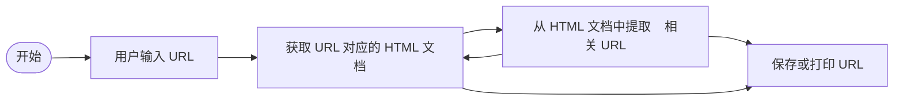
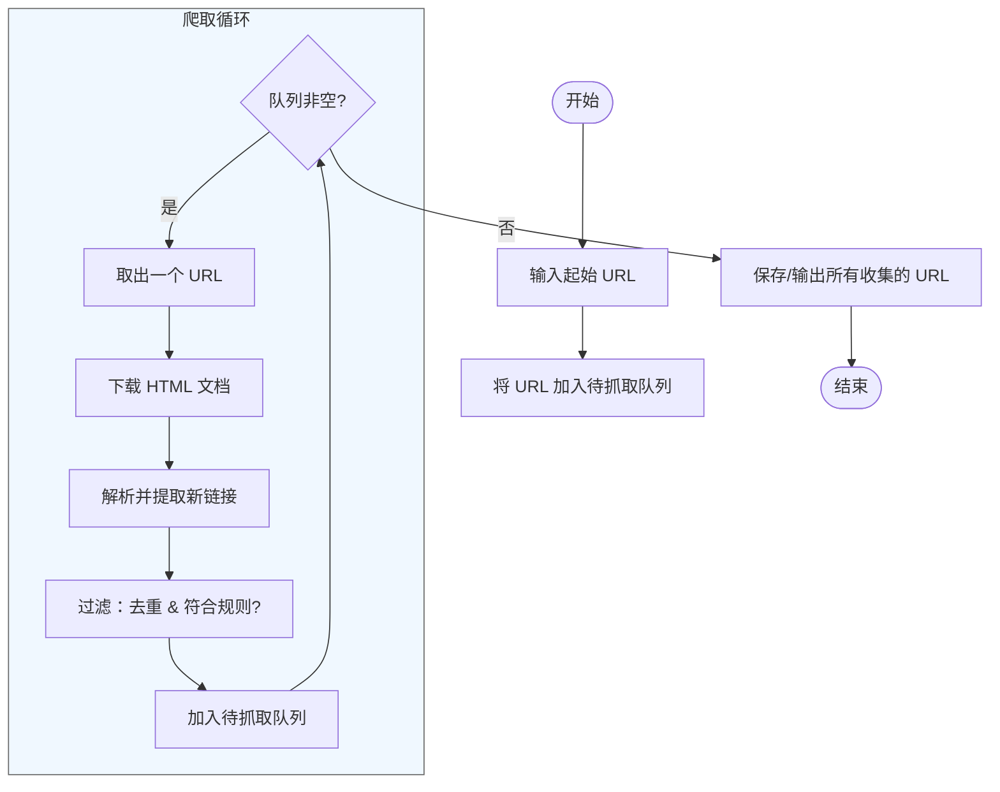

# drawio流程图与代码流程注释

对于大部分人来说，drawio 只适合已稳定的项目，实际上最佳操作永远是文档注释，随着代码变更同步变更。

以流程图为例：

可以在代码的文档注释中添加流程注释，然后让 ai 基于这些注释生成 .drawio 文件

> 需要注意的是：这样生成的 drawio 文件显然就是面向过程的，与代码强绑定的，顶多可以辅助理解项目，实际上终究不能上台面。 但是话虽如此，这本就是快速迭代阶段的折中之举罢了，仁者见仁智者见智。

---

**思考点：**

现在有了新的思考，有些时候，画图本就是开发之前的行为，帮助项目设计。可是上面提到的内容，反倒是先有代码，再有图了，这又不对了。

基于刚刚的思考点，展开说说：

以 BFS 广度优先搜索发现所有相关 URL 为例：

千问优化后的 Mermaid 代码：

> 自己进行初步设想后，**用千问或者 gemini 探讨优化**
> 
> 虽然很多需求，直接让 AI 设计更好，但是为了提升个人的能力，还是得自己多去设想啊，不能全交给 AI，这会丧失竞争力的