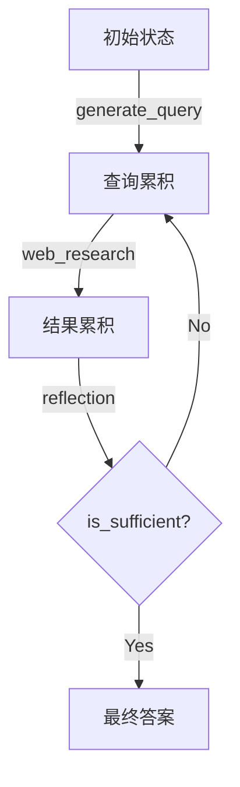

# 阶段 1: 后端核心 - 状态管理

## 📚 学习目标

- 理解 LangGraph 中的状态概念
- 掌握 TypedDict 和 Annotated 的使用
- 理解状态如何在节点间流动和累积
- 理解 Configuration 配置模式
- 掌握 Pydantic BaseModel 的结构化输出

---

## 🎯 核心概念

### LangGraph 状态系统

在 LangGraph 中,**状态** 是在节点之间流动的数据载体。每个节点接收状态,处理数据,然后返回状态更新。

#### 状态的特点

1. **不可变性**: 状态更新会创建新状态,而不是修改原状态
2. **类型安全**: 使用 TypedDict 确保结构清晰
3. **累积性**: 某些字段可以累积多个节点的输出
4. **层次化**: 不同节点可以使用不同的状态视图

---

## 📊 状态类的层次结构

### 1. OverallState (全局状态)

**文件位置**: `backend/src/agent/state.py:13-21`

```python
class OverallState(TypedDict):
    messages: Annotated[list, add_messages]
    search_query: Annotated[list, operator.add]
    web_research_result: Annotated[list, operator.add]
    sources_gathered: Annotated[list, operator.add]
    initial_search_query_count: int
    max_research_loops: int
    research_loop_count: int
    reasoning_model: str
```

**字段解析**:

| 字段 | 类型 | 累积方式 | 用途 |
|------|------|---------|------|
| `messages` | `Annotated[list, add_messages]` | 消息追加 | 对话历史,包括用户消息和 AI 回答 |
| `search_query` | `Annotated[list, operator.add]` | 列表合并 | 累积所有生成的搜索查询 |
| `web_research_result` | `Annotated[list, operator.add]` | 列表合并 | 累积所有搜索结果摘要 |
| `sources_gathered` | `Annotated[list, operator.add]` | 列表合并 | 累积所有收集的来源信息 |
| `initial_search_query_count` | `int` | 覆盖 | 初始查询数量 |
| `max_research_loops` | `int` | 覆盖 | 最大研究循环次数 |
| `research_loop_count` | `int` | 覆盖 | 当前循环计数 |
| `reasoning_model` | `str` | 覆盖 | 推理模型名称 |

**关键点**:

- `OverallState` 贯穿整个图的执行过程
- 前四个字段使用 `Annotated` 实现累积
- 后四个字段使用简单类型,会被覆盖

### 2. ReflectionState (反思状态)

**文件位置**: `backend/src/agent/state.py:24-29`

```python
class ReflectionState(TypedDict):
    is_sufficient: bool
    knowledge_gap: str
    follow_up_queries: Annotated[list, operator.add]
    research_loop_count: int
    number_of_ran_queries: int
```

**用途**: 专门用于反思节点的状态

| 字段 | 类型 | 说明 |
|------|------|------|
| `is_sufficient` | `bool` | 当前研究是否充分 |
| `knowledge_gap` | `str` | 缺失的知识描述 |
| `follow_up_queries` | `Annotated[list, operator.add]` | 后续查询(累积) |
| `research_loop_count` | `int` | 当前循环次数 |
| `number_of_ran_queries` | `int` | 已执行的查询数量 |

### 3. QueryGenerationState (查询生成状态)

**文件位置**: `backend/src/agent/state.py:37-38`

```python
class QueryGenerationState(TypedDict):
    search_query: list[Query]
```

**用途**: 查询生成节点的输出状态

### 4. WebSearchState (网络搜索状态)

**文件位置**: `backend/src/agent/state.py:41-43`

```python
class WebSearchState(TypedDict):
    search_query: str
    id: str
```

**用途**: 单个网络搜索任务的状态,支持并行执行

### 5. Query (查询对象)

**文件位置**: `backend/src/agent/state.py:32-34`

```python
class Query(TypedDict):
    query: str
    rationale: str
```

**用途**: 表示单个搜索查询,包含查询字符串和理由

### 6. SearchStateOutput (搜索输出)

**文件位置**: `backend/src/agent/state.py:46-48`

```python
@dataclass(kw_only=True)
class SearchStateOutput:
    running_summary: str = field(default=None)  # Final report
```

**用途**: 使用 dataclass 定义的最终报告输出

---

## 🔑 Annotated 机制详解

### 什么是 Annotated?

`Annotated` 是 Python 的类型注解工具,允许为类型添加元数据。在 LangGraph 中,它用于定义状态的**更新策略**。

### operator.add vs add_messages

#### 1. operator.add (列表合并)

**使用场景**: `search_query`, `web_research_result`, `sources_gathered`

```python
search_query: Annotated[list, operator.add]
```

**行为**:
```python
# 初始状态
state["search_query"] = ["query1"]

# 节点 A 返回
{"search_query": ["query2", "query3"]}

# 结果
state["search_query"] = ["query1", "query2", "query3"]
```

**使用 `operator.add` 的原因**:
- ✅ 多个节点可能生成查询,需要累积
- ✅ 保留所有查询的完整历史
- ✅ 支持并行执行的结果合并

#### 2. add_messages (消息追加)

**使用场景**: `messages`

```python
messages: Annotated[list, add_messages]
```

**行为**:
```python
# 初始状态
state["messages"] = [HumanMessage("Hello")]

# 节点返回
{"messages": [AIMessage("Hi there!")}

# 结果
state["messages"] = [
    HumanMessage("Hello"),
    AIMessage("Hi there!")
]
```

**使用 `add_messages` 的原因**:
- ✅ LangChain 的消息追加机制
- ✅ 自动处理消息类型和格式
- ✅ 保持对话历史的一致性

#### 累积机制对比

| 操作 | operator.add | add_messages |
|------|--------------|--------------|
| 初始值 | `[]` | `[]` |
| 第一次更新 | `["a"]` | `[msg1]` |
| 第二次更新 | `["a", "b"]` | `[msg1, msg2]` |
| 并行更新 | 合并所有列表 | 追加所有消息 |
| 去重 | ❌ 不去重 | ❌ 不去重 |

---

## ⚙️ Configuration 配置管理

### Configuration 类

**文件位置**: `backend/src/agent/configuration.py:8-60`

```python
class Configuration(BaseModel):
    query_generator_model: str = Field(default="gemini-2.0-flash", ...)
    reflection_model: str = Field(default="gemini-2.5-flash", ...)
    answer_model: str = Field(default="gemini-2.5-pro", ...)
    number_of_initial_queries: int = Field(default=3, ...)
    max_research_loops: int = Field(default=2, ...)
```

### 配置字段详解

| 字段 | 默认值 | 说明 |
|------|--------|------|
| `query_generator_model` | `gemini-2.0-flash` | 用于生成搜索查询的模型 |
| `reflection_model` | `gemini-2.5-flash` | 用于反思的模型 |
| `answer_model` | `gemini-2.5-pro` | 用于生成最终答案的模型 |
| `number_of_initial_queries` | `3` | 初始生成的查询数量 |
| `max_research_loops` | `2` | 最大研究循环次数 |

### from_runnable_config 方法

**文件位置**: `backend/src/agent/configuration.py:42-60`

```python
@classmethod
def from_runnable_config(
    cls, config: Optional[RunnableConfig] = None
) -> "Configuration":
    """Create a Configuration instance from a RunnableConfig."""
    configurable = (
        config["configurable"] if config and "configurable" in config else {}
    )

    # Get raw values from environment or config
    raw_values: dict[str, Any] = {
        name: os.environ.get(name.upper(), configurable.get(name))
        for name in cls.model_fields.keys()
    }

    # Filter out None values
    values = {k: v for k, v in raw_values.items() if v is not None}

    return cls(**values)
```

**优先级顺序**:
1. 环境变量 (`QUERY_GENERATOR_MODEL`)
2. RunnableConfig 中的 `configurable`
3. 默认值

**使用示例**:
```python
# 从环境变量加载
config = Configuration.from_runnable_config()

# 从 RunnableConfig 加载
config = Configuration.from_runnable_config({
    "configurable": {
        "max_research_loops": 5,
        "number_of_initial_queries": 5
    }
})
```

---

## 🎨 Pydantic BaseModel - 结构化输出

### SearchQueryList (搜索查询列表)

**文件位置**: `backend/src/agent/tools_and_schemas.py:5-11`

```python
class SearchQueryList(BaseModel):
    query: List[str] = Field(
        description="A list of search queries to be used for web research."
    )
    rationale: str = Field(
        description="A brief explanation of why these queries are relevant to the research topic."
    )
```

**用途**: 确保模型输出符合预期的 JSON 格式

**示例输出**:
```json
{
  "query": ["renewable energy trends 2024", "solar energy advancements"],
  "rationale": "These queries cover recent developments and specific technologies."
}
```

### Reflection (反思结果)

**文件位置**: `backend/src/agent/tools_and_schemas.py:14-23`

```python
class Reflection(BaseModel):
    is_sufficient: bool = Field(
        description="Whether the provided summaries are sufficient to answer the user's question."
    )
    knowledge_gap: str = Field(
        description="A description of what information is missing or needs clarification."
    )
    follow_up_queries: List[str] = Field(
        description="A list of follow-up queries to address the knowledge gap."
    )
```

**用途**: 结构化反思节点的输出

**示例输出**:
```json
{
  "is_sufficient": false,
  "knowledge_gap": "Missing information about cost trends and policy changes.",
  "follow_up_queries": ["renewable energy cost trends 2024", "energy policy 2024"]
}
```

### Pydantic 的优势

1. **类型验证**: 自动验证输入数据类型
2. **结构化输出**: 强制 LLM 输出符合预期的格式
3. **文档化**: Field 的 description 作为提示词的一部分
4. **序列化**: 易于转换为 JSON

---

## 🔄 状态流动示例

### 示例: 完整的研究流程

#### 初始状态
```python
{
    "messages": [HumanMessage("What are the latest trends in renewable energy?")],
    "search_query": [],
    "web_research_result": [],
    "sources_gathered": [],
    "initial_search_query_count": 3,
    "max_research_loops": 2,
    "research_loop_count": 0,
    "reasoning_model": "gemini-2.5-pro"
}
```

#### 查询生成后
```python
{
    "messages": [HumanMessage("...")],
    "search_query": [  # 使用 operator.add 累积
        {"query": "renewable energy trends 2024", "rationale": "..."},
        {"query": "solar energy advancements", "rationale": "..."},
        {"query": "wind energy technology", "rationale": "..."}
    ],
    "web_research_result": [],
    "sources_gathered": [],
    # ... 其他字段不变
}
```

#### 网络搜索后
```python
{
    "messages": [HumanMessage("...")],
    "search_query": [...],
    "web_research_result": [  # 累积 3 个搜索结果
        "Summary of search results for query 1...",
        "Summary of search results for query 2...",
        "Summary of search results for query 3..."
    ],
    "sources_gathered": [  # 累积来源信息
        {"url": "...", "title": "..."},
        {"url": "...", "title": "..."},
        ...
    ],
    "research_loop_count": 1,
    # ...
}
```

#### 反思后
```python
{
    "messages": [
        HumanMessage("..."),
        AIMessage("Based on the research...")
    ],
    "search_query": [...],
    "web_research_result": [...],
    "sources_gathered": [...],
    "research_loop_count": 2,  # 增加
    # 如果 is_sufficient=False,会有更多 search_query 累积
}
```

#### 最终答案后
```python
{
    "messages": [
        HumanMessage("..."),
        AIMessage("Here's a comprehensive answer...")  # 最终答案
    ],
    "search_query": [...],
    "web_research_result": [...],
    "sources_gathered": [...],
    "research_loop_count": 2,
    # ...
}
```

---

## 🎯 状态设计原则

### 1. 区分累积和覆盖

**累积** (`Annotated[list, operator.add]`):
- 多个节点贡献信息
- 需要保留完整历史
- 支持并行执行

**覆盖** (简单类型):
- 单一真相源
- 最新的值最重要
- 配置和控制参数

### 2. 状态分层

- **OverallState**: 全局共享状态
- **特定 State**: 节点专用状态
- **避免污染**: 不相关的字段不要放在 OverallState

### 3. 类型安全

- 使用 `TypedDict` 定义结构
- 使用 `Pydantic BaseModel` 定义输出
- 利用类型检查工具 (mypy)

---

## 💡 实践建议

### 1. 手动绘制状态转换图



### 2. 修改配置观察变化

编辑 `backend/.env`:

```env
QUERY_GENERATOR_MODEL=gemini-2.0-flash-exp
REFLECTION_MODEL=gemini-2.5-flash-exp
ANSWER_MODEL=gemini-2.5-pro-exp-03-25
NUMBER_OF_INITIAL_QUERIES=5
MAX_RESEARCH_LOOPS=3
```

### 3. 添加新状态字段

```python
class OverallState(TypedDict):
    # ... 现有字段
    custom_field: str  # 新增自定义字段
```

### 4. 调试状态变化

在节点中添加打印:

```python
def my_node(state: OverallState) -> dict:
    print(f"Current state: {state}")
    return {"search_query": ["new query"]}
```

---

## ✅ 阶段 1 总结

### 关键收获

1. **状态系统**: LangGraph 使用 TypedDict 定义状态结构
2. **累积机制**: `Annotated[list, operator.add]` 实现状态累积
3. **消息管理**: `add_messages` 专门处理对话历史
4. **配置管理**: Configuration 从环境变量和 RunnableConfig 加载
5. **结构化输出**: Pydantic BaseModel 确保 LLM 输出格式正确

### 核心概念图

```
┌─────────────────────────────────────────┐
│         OverallState (全局状态)          │
├─────────────────────────────────────────┤
│ messages: Annotated[list, add_messages] │  ← 对话历史
│ search_query: Annotated[list, +]        │  ← 查询累积
│ web_research_result: Annotated[list, +] │  ← 结果累积
│ sources_gathered: Annotated[list, +]    │  ← 来源累积
│ initial_search_query_count: int         │  ← 配置
│ max_research_loops: int                 │  ← 配置
│ research_loop_count: int                │  ← 计数
│ reasoning_model: str                    │  ← 配置
└─────────────────────────────────────────┘
           ↓             ↓             ↓
    QueryGenerationState  ReflectionState  WebSearchState
    (查询生成视图)        (反思视图)        (搜索视图)
```

### 下一步

进入**阶段 2: LangGraph 图结构**,深入学习:
- `graph.py` - 节点、边、条件路由
- `utils.py` - 工具函数
- `prompts.py` - 系统提示词

### 学习验证

在进入下一阶段前,确保能够:

- [ ] 解释为什么 `search_query` 使用 `operator.add`
- [ ] 区分四种状态类的使用场景
- [ ] 理解 Configuration 如何从环境变量加载
- [ ] 能画出状态在节点间的流动图
- [ ] 能添加新的状态字段并测试

---

## 📚 延伸阅读

- [Python Typing: Annotated](https://docs.python.org/3/library/typing.html#typing.Annotated)
- [Pydantic BaseModel](https://docs.pydantic.dev/latest/concepts/models/)
- [LangGraph State Management](https://langchain-ai.github.io/langgraph/concepts/low_level/#state)
- [TypedDict 官方文档](https://docs.python.org/3/library/typing.html#typing.TypedDict)

---

*下一阶段: 深入学习 LangGraph 图结构*
